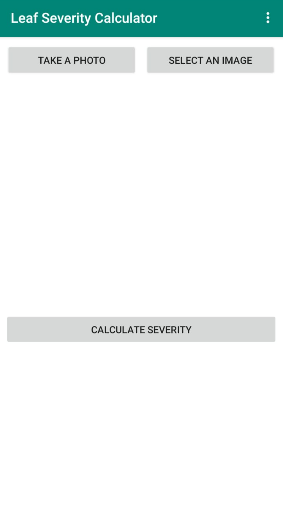
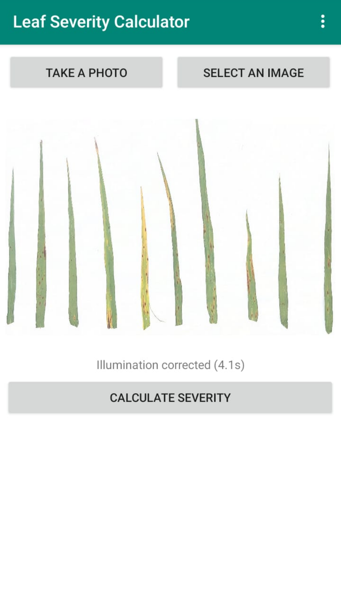
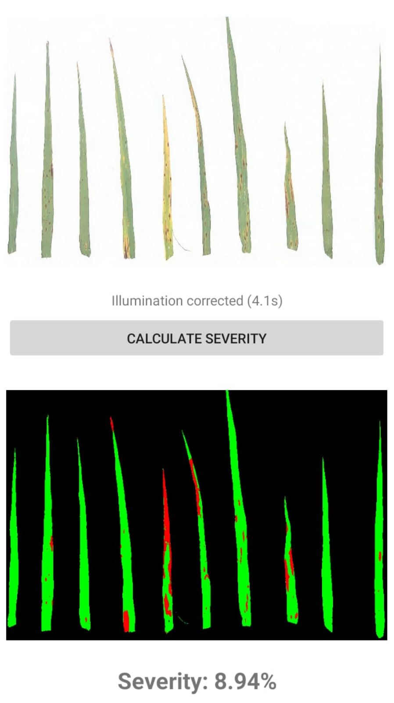
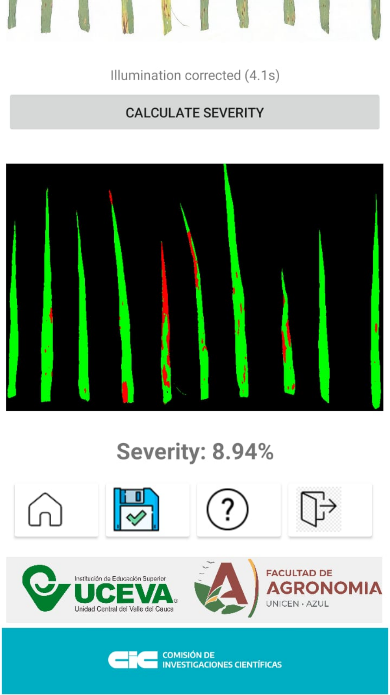
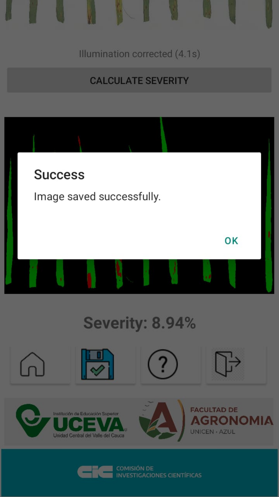

# Leaf Severity Calculator - OpenCV-based Branch

**Version**: 0.0.9b1 | **Stack**: Python 3.8 + Briefcase 0.3.19 | **Status**: ✅ Legacy Stable

## Overview

Cross-platform Android application for analyzing barley leaf disease severity. This **OpenCV-based branch** maintains a **Python 3.8 legacy stack** with pre-compiled wheels for broader compatibility with older Android devices.

## App Screenshots

### Main Flow





### Results and Actions




### Key Features

- 📸 **Capture & Upload**: Device camera or gallery image selection
- 🔬 **Threshold-Based Segmentation**: Uses fixed thresholds on blue channel (`ub`) and index `(green-red)/(green+red)` (`ui`); these values were calibrated offline using Otsu/K-means during model setup
- 📊 **Severity Calculation**: Real-time disease percentage computation
- 💾 **Save Results**: Export processed images to `/sdcard/Download/LeafSeverityImages`
- 🌐 **Full English USA UI**: All strings localized to English
- 📱 **Broad Device Support**: Python 3.8 compatible with older Android devices
- 🎯 **Multi-ABI Support**: arm64-v8a, armeabi-v7a, x86_64

## Why This Branch?

| Aspect | Main (0.0.9a1) | OpenCV-based (0.0.9b1) |
|--------|---|---|
| Python Version | 3.12 (Latest) | 3.8 (Legacy) |
| Briefcase | 0.3.22 (Current) | 0.3.19 (Stable) |
| Dependencies | PyPI (Latest) | Pre-built wheels (cp38) |
| Device Compatibility | Modern devices (API 24+) | **Broader range** |
| Performance | Optimized | Stable, reliable |
| Use Case | New apps, modern devices | Legacy devices, stability |

**Choose this branch if**: You need to support older Android devices or require the proven stability of Python 3.8 + OpenCV 4.5.1 + NumPy 1.19.5 stack.

## Branch Processing Notes (Main vs OpenCV-based)

Both branches keep the same user-facing workflow:

- Camera/gallery image selection
- Illumination correction before severity calculation
- Aspect-ratio-preserving resize (fit inside 800x600)
- Threshold segmentation and severity display

Implementation differs by branch:

- **main**
    - Illumination correction: `numpy-rolling-ball`
    - Processing style: NumPy-first pipeline
    - Android stack: newer API/memory requirements (cp312 ecosystem)
- **OpenCV-based**
    - Illumination correction: `opencv-rolling-ball` (`cv2_rolling_ball`)
    - Processing style: OpenCV for decode/resize/encode + NumPy masks for severity math
    - Android stack: legacy compatibility (cp38 wheels, older device support)

This split is intentional and reflects compatibility/memory constraints between modern and legacy Android targets.

## Technology Stack

| Component | Version | Source | Note |
|-----------|---------|--------|------|
| Python | 3.8 | Local venv (.venv38) | Python 3.12 not compatible with cp38 wheels |
| Briefcase | 0.3.19 | Local venv | Matches Briefcase template v0.3.19 |
| toga-android | ~0.4.5 | PyPI | |
| NumPy | 1.19.5 | Local wheels (cp38) | Pre-built for Android ABIs |
| opencv-python | 4.5.1.48 | Local wheels (cp38) | Pre-built for Android ABIs |
| opencv-rolling-ball | Latest | PyPI | |
| tatogalib | 0.9.6 | Local wheel (universal) | File browser integration |

## Project Structure

```
leafseveritycalculator/
├── .venv38/                            # Python 3.8 virtual environment (local)
├── src/leafseveritycalculator/
│   ├── __init__.py
│   ├── app.py                          # Main application logic
│   ├── __main__.py
│   └── resources/                      # App resources
├── android/
│   └── app_template/
│       └── src/main/
│           ├── AndroidManifest.xml     # Permissions config
│           └── res/                    # Drawables, layouts, strings
├── tests/
│   ├── __init__.py
│   ├── _support.py
│   ├── test_app.py
│   └── leafseveritycalculator.py
├── wheels/                             # Local pre-built Android wheels
│   ├── numpy-1.19.5-0-cp38-cp38-android_21_arm64_v8a.whl
│   ├── numpy-1.19.5-0-cp38-cp38-android_16_armeabi_v7a.whl
│   ├── numpy-1.19.5-0-cp38-cp38-android_21_x86_64.whl
│   ├── opencv_python-4.5.1.48-1-cp38-cp38-android_21_arm64_v8a.whl
│   ├── opencv_python-4.5.1.48-1-cp38-cp38-android_16_armeabi_v7a.whl
│   ├── opencv_python-4.5.1.48-1-cp38-cp38-android_21_x86_64.whl
│   ├── tatogalib-0.9.6-py3-none-any.whl
│   └── numpy_rolling_ball-1.0.0-py3-none-any.whl (universal)
├── pyproject.toml                      # Project configuration + ABI-organized wheels
└── CHANGELOG
```

### Why there is a second README/LICENSE inside `leafseveritycalculator/`

That folder is the **Briefcase app project root** (packaging root for Android builds). Keeping `README.rst` and `LICENSE` there is normal for BeeWare/Briefcase projects, while root-level docs are for repository-level information.

- Root docs/files: repository documentation for contributors and GitHub
- `leafseveritycalculator/README.rst` and `leafseveritycalculator/LICENSE`: app packaging metadata and project-local docs

The duplication is acceptable and expected in this repo layout.

## Getting Started

### Prerequisites

⚠️ **IMPORTANT**: This branch requires **Python 3.8**, not 3.12.

- **Python 3.8.x** (Windows, macOS, or Linux)
  - Download: [python.org/downloads/release/python-3810/](https://www.python.org/downloads/release/python-3810/)
- **Android SDK** (API 21+)
- **Android NDK**
- **Java Development Kit (JDK)** 11+
- **Briefcase 0.3.19** (not 0.3.22)

### Installation & Setup

1. **Clone the repository**:
   ```bash
   git clone https://github.com/alencina-faa/Leaf-Severity-Calculator_android.git
   cd Leaf-Severity-Calculator_android
   git checkout OpenCV-based  # Switch to this branch
   ```

2. **Create Python 3.8 virtual environment**:
   ```bash
   # Windows
   python3.8 -m venv .venv38
   .venv38\Scripts\activate
   
   # macOS/Linux
   python3.8 -m venv .venv38
   source .venv38/bin/activate
   ```

3. **Install dependencies**:
   ```bash
   pip install --upgrade pip setuptools wheel
   pip install briefcase==0.3.19
   ```

   ⚠️ **Do NOT upgrade Briefcase** - version 0.3.19 is required for this stack.

### Building for Android

#### Development/Debug Build

```bash
cd leafseveritycalculator

# Ensure .venv38 is activated
# On Windows: .\.venv38\Scripts\activate
# On macOS/Linux: source ../.venv38/bin/activate

# Initial setup
.venv38\Scripts\python -m briefcase create android --no-input

# Build debug APK
.venv38\Scripts\python -m briefcase build android

# Package debug APK
.venv38\Scripts\python -m briefcase package android
```

**Output**: `dist/LeafSeverityCalculator-0.0.9b1.apk`

#### Release Build

```bash
cd leafseveritycalculator

# Update dependencies (rebuilds with local wheels)
.venv38\Scripts\python -m briefcase update android -r

# Package release AAB (for Google Play)
.venv38\Scripts\python -m briefcase package android
```

**Output**: `dist/LeafSeverityCalculator-0.0.9b1.aab` (67.15 MB with all ABI wheels)

### ABI Support

This branch includes local wheels for **three Android ABIs**:

| ABI | API Level | Architecture | Primary Device | Wheel Status |
|-----|-----------|--------------|---|---|
| arm64-v8a | 21 | 64-bit ARM | Modern Android phones | ✅ Included |
| armeabi-v7a | 16 | 32-bit ARM | Older Android phones | ✅ Included |
| x86_64 | 21 | 64-bit x86 | Emulators, tablets | ✅ Included |

**Build output**: APK/AAB contains Python + wheels for **all ABIs** (~67 MB). Chaquopy automatically selects the correct wheel for each device's architecture.

## Local Wheels Management

### Why Local Wheels?

NumPy 1.19.5 and OpenCV 4.5.1.48 are old packages with broken setuptools build backends (missing `setuptools.extern.six`). Pre-built `.whl` files bypass the build process entirely.

### Wheel Organization (by ABI)

In `pyproject.toml`, wheels are organized explicitly:

```toml
[tool.briefcase.app.leafseveritycalculator.android]
requires = [
    "toga-android~=0.4.5",
    # NumPy & OpenCV wheels - organized by ABI for explicit matching
    # ARM64-v8a (API 21)
    "../wheels/numpy-1.19.5-0-cp38-cp38-android_21_arm64_v8a.whl",
    "../wheels/opencv_python-4.5.1.48-1-cp38-cp38-android_21_arm64_v8a.whl",
    # ARMv7a (API 16)
    "../wheels/numpy-1.19.5-0-cp38-cp38-android_16_armeabi_v7a.whl",
    "../wheels/opencv_python-4.5.1.48-1-cp38-cp38-android_16_armeabi_v7a.whl",
    # x86_64 (API 21)
    "../wheels/numpy-1.19.5-0-cp38-cp38-android_21_x86_64.whl",
    "../wheels/opencv_python-4.5.1.48-1-cp38-cp38-android_21_x86_64.whl",
    # Universal wheels
    "../wheels/tatogalib-0.9.6-py3-none-any.whl",
    "opencv-rolling-ball",
]
```

### Adding/Updating Wheels

1. Download wheel from [Chaquopy PyPI index](https://chaquo.com/pypi-13.1)
2. Place in `wheels/` directory
3. Add reference in `pyproject.toml` under appropriate ABI section
4. Rebuild: `.venv38\Scripts\python -m briefcase update android -r`

## Key Dependencies Explained

### NumPy 1.19.5
- **Why 1.19.5**: Last version compatible with Python 3.8 + Briefcase 0.3.19
- **Pre-built wheels**: For cp38 across all ABIs (arm64-v8a, armeabi-v7a, x86_64)
- **Usage**: Array operations, channel extraction, mathematical processing

### OpenCV 4.5.1.48
- **Why 4.5.1**: Stable release compatible with legacy Briefcase stack
- **Pre-built wheels**: For cp38 across all ABIs
- **Usage**: Image filtering, rolling-ball background subtraction (via opencv-rolling-ball)

### Briefcase 0.3.19
- **Template version**: Matches `v0.3.19` from BeeWare GitHub
- **Do NOT upgrade**: Version 0.3.22 breaks Python 3.8 compatibility

## Running on Device

1. **Activate venv**:
   ```bash
   .venv38\Scripts\activate  # or source .venv38/bin/activate
   ```

2. **Build and install**:
   ```bash
   cd leafseveritycalculator
   .venv38\Scripts\python -m briefcase package android
   adb install dist/LeafSeverityCalculator-0.0.9b1.apk
   ```

3. **Grant permissions** (on first launch):
   - Camera access
   - Storage read/write

4. **Launch** from device app drawer

## Development Notes

### Testing

```bash
cd leafseveritycalculator
.venv38\Scripts\python -m pytest tests/
```

### Code Structure

**Main Application** (`src/leafseveritycalculator/app.py`):
- `LeafSeverityCalculator`: App class
- `startup()`: Initialize UI
- `take_photo()`: Camera integration
- `open_image()`: Gallery file picker
- `extract_background_color()`: Illumination correction (rolling-ball)
- `process_image()`: Image segmentation + severity calculation
- `save_image()`: Save results

### Android Build Configuration

Set in `pyproject.toml` `build_gradle_extra_content`:

```gradle
android {
    defaultConfig {
        ndk {
            abiFilters 'arm64-v8a'
        }
    }
    
    signingConfigs {
        release {
            keyAlias "upload-key"
            keyPassword "android"
            storePassword "android"
            storeFile file("F:\\Users\\Alberto\\.android\\upload-key-leafseveritycalculator.jks")
        }
    }
    
    buildTypes {
        release {
            signingConfig signingConfigs.release
            minifyEnabled true
            shrinkResources true
        }
    }
}
```

## Troubleshooting

### Issue: "Python 3.12 not compatible with wheel cp38-cp38-android_21_arm64_v8a"
**Solution**: Ensure you're using Python 3.8:
```bash
python --version  # Should print 3.8.x
.venv38\Scripts\python --version  # Activate venv and verify
```

### Issue: "ModuleNotFoundError: setuptools.extern.six"
**Solution**: This error happens when building old numpy/opencv from source. Use pre-built wheels only. Don't try to install via pip:
```bash
# ❌ Wrong - don't do this:
pip install numpy==1.19.5

# ✅ Correct - wheels already in repo:
# (Wheels are automatically included via pyproject.toml)
```

### Issue: "Briefcase command not found"
**Solution**: Ensure venv is activated:
```bash
.venv38\Scripts\activate
pip install briefcase==0.3.19
```

### Issue: Build fails with "gradle build" error
**Solution**: Clean build artifacts and retry:
```bash
cd leafseveritycalculator
if (Test-Path "build\leafseveritycalculator\android") { 
    Remove-Item -Recurse -Force "build\leafseveritycalculator\android" 
}
.venv38\Scripts\python -m briefcase create android --no-input
.venv38\Scripts\python -m briefcase package android
```

## Environment Configuration

### Environment Variables

```bash
ANDROID_HOME       # Path to Android SDK
ANDROID_SDK_ROOT   # Alternative Android SDK path
ANDROID_NDK_ROOT   # Path to Android NDK
JAVA_HOME          # Path to JDK 11+
```

### .gitignore

Already configured to exclude:
- `.venv38/` - Local Python 3.8 environment
- `build/` - Build artifacts
- `dist/` - Build outputs
- `*.pyc` - Python bytecode

## Version Information

- **Current**: 0.0.9b1 (Beta Release)
- **Branch**: OpenCV-based (Legacy stable stack)
- **Python**: 3.8.x
- **Briefcase**: 0.3.19
- **Last Updated**: April 24, 2026

## Related Branches

- **main**: Modern Python 3.12 + Briefcase 0.3.22 stack
  - Latest dependencies from PyPI
  - Better performance on modern devices
  - See `main` branch README

## Deployment to Google Play

1. **Ensure build succeeds**:
   ```bash
   .venv38\Scripts\python -m briefcase package android
   # Output: dist/LeafSeverityCalculator-0.0.9b1.aab (67.15 MB)
   ```

2. **Sign release** (already configured in `pyproject.toml`)

3. **Upload to Play Console**:
   - Navigate to [Google Play Console](https://play.google.com/console)
   - Select LeafSeverityCalculator
   - **Release** → **Testing** (recommended first) or **Production**
   - Upload `dist/LeafSeverityCalculator-0.0.9b1.aab`
   - Add release notes
   - Review and publish

## Contributing

1. Create feature branch from `OpenCV-based`
2. Test with `.venv38` activated
3. Update version in `pyproject.toml` (PEP 440 format)
4. Update CHANGELOG if major changes
5. Commit and create pull request

## License

See [LICENSE](../LICENSE) file.

## Authors

- Emiliano David
- Alberto Lencina
- Luisa Cabezas

**Institution**: Facultad de Agronomía, Universidad Nacional del Centro de la Provincia de Buenos Aires (UNICEN)

**Email**: alencina@azul.faa.unicen.edu.ar

## Additional Resources

- [BeeWare Briefcase v0.3.19 Docs](https://briefcase.readthedocs.io/en/0.3.19/)
- [Toga UI Toolkit](https://toga.readthedocs.io/)
- [Chaquopy Python-Android Build System](https://chaquo.com/chaquopy/)
- [NumPy 1.19.5 Release Notes](https://numpy.org/devdocs/release/1.19.5-notes.html)
- [OpenCV 4.5.1 Release Notes](https://github.com/opencv/opencv/releases/tag/4.5.1)

---

**Status**: ✅ Stable Legacy | **Last Build**: LeafSeverityCalculator-0.0.9b1.aab (67.15 MB)
