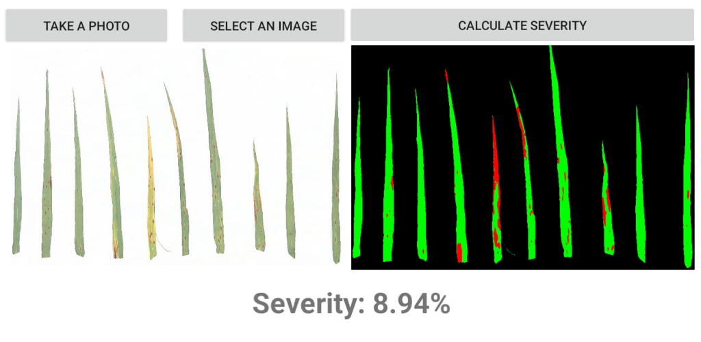

LeafSeverityCalculator
======================

This application segments a photo or image of barley leaves pasted on 
a white sheet of paper into: background (black), healthy leaf portion (green), and diseased 
leaf portion (red). It then calculates the severity as the percentage of pixels in the diseased 
leaf regions relative to the total leaf pixels. The values ​​used for segmentation were obtained 
from a sample of training images using the Otsu algorithm for the blue band and the Kmeans 
algorithm for the (red - green) / (red + green) index

Screenshots
-----------

.. image:: screenshots/image1.png
	:alt: Screenshot 1
	:width: 260px

.. image:: screenshots/image2.png
	:alt: Screenshot 2
	:width: 260px

.. image:: screenshots/image3.png
	:alt: Screenshot 3
	:width: 260px

.. image:: screenshots/image4.png
	:alt: Screenshot 4
	:width: 260px

.. image:: screenshots/image5.png
	:alt: Screenshot 5
	:width: 260px

**This cross-platform app was generated by** `Briefcase`_ **- part of**
`The BeeWare Project`_. 

.. _`Briefcase`: https://briefcase.readthedocs.io/
.. _`The BeeWare Project`: https://beeware.org/
